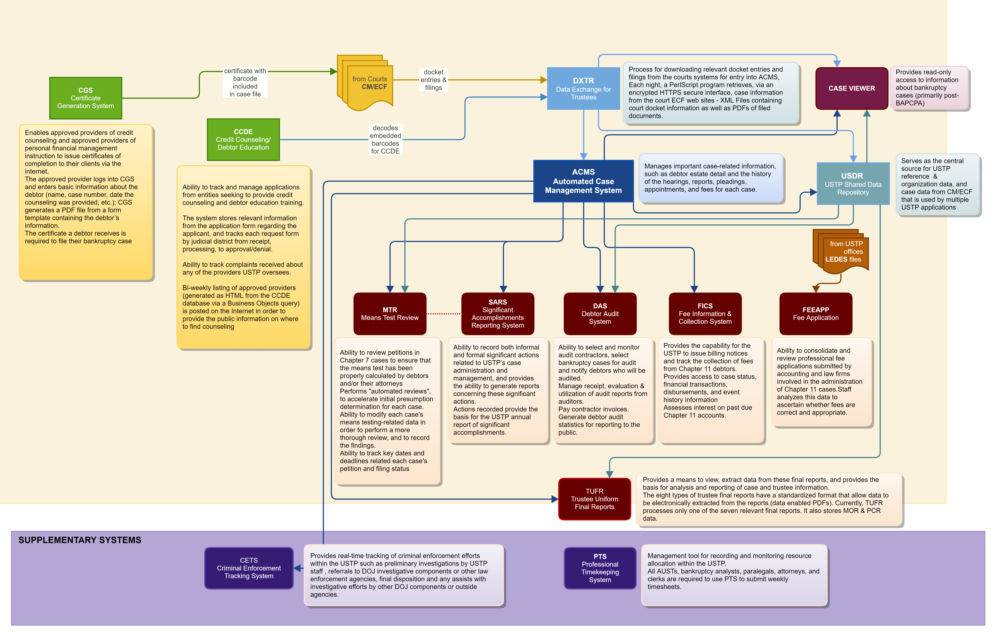

- [Appendix A](#appendix-a)
  - [Technical Overview](#technical-overview)
    - [Download, Archive, & Delete (DAD) Service](#download-archive--delete-dad-service)
    - [Automated Case Management System (ACMS)](#automated-case-management-system-acms)
    - [Web Applications](#web-applications)
    - [Trustee Final Report Generation System (TFRGS)](#trustee-final-report-generation-system-tfrgs)
    - [Supporting Databases](#supporting-databases)
    - [Application Development/Support Systems](#application-developmentsupport-systems)
    - [Reporting](#reporting)

# Appendix A

## Technical Overview

**Diagram of USTP Systems**

The below diagram will help illustrate how USTP applications interact with each other during the lifecycle of a bankruptcy case.

### Download, Archive, & Delete (DAD) Service

#### Overview

The DAD boundary is the one aspect of the DXTR enterprise that communicates with external services for information. This service will execute based off a schedule to communicate with PACER for authentication & authorization, then proceed to download bankruptcy case information from each of the 88 U.S Courts for processing of their XML & PDF data.

#### Technical Details

- Associated Software: .NET Core, NuGet packages, and Visual Studio
- Azure tools: Keyvault, DevOps, Service Fabric, Pipelines, Repos, Blob storage
- Database: Azure SQL Database

### Automated Case Management System (ACMS)

#### Overview

The Automated Case Management System (ACMS) serves as one of the main information systems supporting the USTP mission: to provide review and oversight of the bankruptcy system to protect against fraud and abuse, and ensure a just and speedy resolution of all matters. ACMS helps USTP staff review the case administration of bankruptcy cases. ACMS manages important case-related information, such as debtor estate detail and the history of the hearings, reports, pleadings, appointments, and fees for each case. Much of the information in ACMS is downloaded from bankruptcy court electronic records; however, critical information is still entered by USTP users.

#### Technical Details

ACMS is a legacy system written in RPG/400, an IBM proprietary language. Twenty-one regional versions of the ACMS application and database are in Infinite. Infinite is an emulated IBM mainframe environment. ACMS regional users log in and authenticate through the central server to gain access solely to their respective regional ACMS data.

Additionally, all regional ACMS databases are replicated to a centralized database, from which data is accessed by other applications. Information stored in ACMS drives other bankruptcy management applications.

- Associated Software: RPG/400, 5250 Emulator, InfiniteCloud
- Database: MS SQL Server

### Web Applications

#### Overview

The Executive Office hosts several web-based applications used by the Field and Executive Office staffs. The internal applications have about 1,000 users within the program. The external application CGS has about 3,500 active accounts of a total around 10,000 accounts.

#### Technical Details

Except for two, all the applications follow the J2EE architecture using the software listed in the attachment. All the applications in this section are configured as follows:

- Software: Apache, JBoss, Struts, and Hibernate
- Language: Java
- Database: SQL Server/Azure SQL

#### Data Exchange for Trustees Management System (DXTRMS)

DXTRMS enables the viewing and modification of the parameters that control the behavior of the DXTR system.

#### Credit Counseling and Debtor Education (CCDE)

The Bankruptcy Abuse Prevention and Consumer Protection Act of 2005 (BAPCPA) added both a pre-filing credit counseling and a post-filing debtor education requirement for individual debtors who file petitions under chapters 7, 11, 12, and 13. Under BAPCPA, the USTP is tasked with selecting and overseeing counselors and educators who apply to provide debtors with these services on a judicial district-by-district basis. Debtors are also required to file with the court a USTP-provided certification that they have received the mandated counseling. The CCDE systems were designed to meet these requirements.

The _Credit Counseling Debtor Education Internal system_ (generally referred to as "CCDE") is an information repository for the USTP that supports the BAPCPA requirements. The system provides the ability to track and manage applications from entities seeking to provide credit counseling and debtor education training. The system stores relevant information from the application form regarding the applicant, and tracks each request form by judicial district from receipt, processing, to approval/denial. CCDE allows USTP staff to track complaints received about any of the providers it oversees. Also, as required by BAPCPA, a bi-weekly listing of approved providers (generated as HTML from the CCDE database via a Business Objects query) is posted on the Internet in order to provide the public information on where to find counseling.

#### Criminal Enforcement Tracking System (CETS)

CETS facilitates the accurate and real-time tracking of criminal enforcement efforts within the USTP such as preliminary investigations by USTP staff, referrals to DOJ investigative components (USAO and FBI) or other law enforcement agencies (SSA, IRS, HUD, Postal Inspector), final disposition and any assists with investigative efforts by other DOJ components or outside agencies. CETS is a Java Servlet based application that executes via a Tomcat (Apache) HTTP server.

#### Debtor Audit System (DAS)

One of the provisions of the BAPCPA legislation is to implement the regular auditing of selected bankruptcy cases to determine the accuracy, veracity, and completeness of the information contained in the petitions, schedules, and statements filed by individual chapter 7 and chapter 13 debtors. To fulfill this requirement, USTP initiated a program to perform the following activities:

- Selection and monitoring of audit contractors
- Selection of bankruptcy cases for audit
- Notification of debtors to be audited
- Receipt, evaluation, and utilization of audit reports
- Generation of debtor audit statistics for reporting to the public

The Debtor Audit System was developed to support the administrative functions of selecting and assigning cases for audit, , and the collection of information for report purposes. DAS connects to the ACMS Replicated Central Database (see below) to retrieve selected case information when the case is first selected for audit, and displays this information to DAS users.

#### Chapter 11 Quarterly Fee Information and Collection System (FICS)

Pursuant to 28 U.S.C. § 1930(a), every chapter 11 debtor (or debtor's representative) must pay a quarterly fee to the United States Trustee until the case is dismissed, converted, or closed by final decree.         FICS is an accounts receivable system that assists the USTP with the noticing and collection of fees from chapter 11 debtors and tracks this activity throughout the life of the case. The FICS system provides the capability for the USTP to issue notices and track the collection of fees from chapter 11 debtors. Chapter 11 data originates from bankruptcy courts and is compiled in ACMS. The FICS application utilizes data from the ACMS database, as well as a separate FICS database, to generate monthly billing notices and delinquencies for every chapter 11 debtor. All quarterly fee payments are mailed to a single bank address, and processed through the Department of Treasury's contract for lockbox services. The USTP receives a daily download of electronic transactions which are electronically posted to FICS.

Data for statement generation is sent from FICS to a noticing contractor for printing and mailing of the statements. The noticing contractor must provide forms and statements printing as well as mailing services. In addition, FICS provides USTP field offices online access to case status, financial transactions, disbursements, and event history information through the web browser application on USTP client workstations. Through the FICS Interest Assessment Component, USTP assesses interest on past due chapter 11 accounts.

#### Means Test Review System (MTR)

Under BAPCPA all individual debtors are required to demonstrate via a "means test" to determine whether they are eligible for chapter 7 (liquidation), or if they are deemed to have sufficient resources, to file under chapter 13 (wage-earner repayment plan). The USTP developed the Means Test Review System (MTR) to facilitate the Program staff's review of petitions in chapter 7 cases to ensure that the means test has been properly calculated.

MTR receives via DXTR data-enabled PDFs of means test forms (Form B22A) filed with the bankruptcy courts. MTR uses the data stripped from these forms to track current monthly income, liabilities, and other relevant data for cases, to verify the results. Using MTR, USTP staff can view all of the PDFs (e.g., petitions, schedules, current monthly income forms, and statements of financial affairs) downloaded by DXTR for all open chapter 7 cases.

Basic case data, such as debtor and attorney information, key dates, and hearing and pleading information is obtained from ACMS.

#### Professional Timekeeping System (PTS)

PTS is a management tool for recording and monitoring resource allocation within the USTP. It provides useful information for management planning, resource allocation and reporting across the Program as well as to Congress and other external agencies. All AUSTs, bankruptcy analysts, paralegals, attorneys, and clerks are required to use PTS to submit weekly timesheets.

Designated Office Reviewers use PTS to review total hours reported for each office. PTS provides real-time reports at the office and regional levels. Data is reported quarterly to the EOUST for analysis across quarters and years.

#### Significant Accomplishments Reporting System (SARS)

SARS allows USTP staff to record both informal and formal significant actions related to USTP's case administration and management and provides the ability to generate reports concerning these significant actions. The actions recorded in SARS (e.g., "Motion Filed; Objection Filed, etc.) closely correlate to the Program's civil enforcement efforts and provide the basis for the USTP annual report of significant accomplishments. SARS is a Java Servlet based application that executes via a Tomcat (Apache) HTTP server.

#### Trustee Uniform Final Reports (TUFR)

Under the Bankruptcy Code, private trustees under chapters 7, 11, 12 and 13 are required to file final reports at the end of their management of the debtor's estate; these reports summarize various transactions, including disbursements to creditors. In support of the USTP's mission of trustee oversight, TUFR provides a means to view, extract data from these final reports, and provides the basis for analysis and reporting of case and trustee information.

As a predecessor effort, the USTP, with the cooperation of private bankruptcy software providers, oversaw the standardization of the format of the eight types of trustee final reports. Most importantly, the standard format specified that the report forms be fielded and tagged to allow data to be electronically extracted from the reports. The process of adding fields and tags to a Portable Document Format (PDF) file is called "data enabling".

The data-enabled forms are downloaded from the courts via the nightly DXTR process (see above). In a separate step, the data-enabled PDF files of trustee final reports are identified, stored in separate folders, and the fielded and tagged data is electronically extracted as an XML stream.

The XML is loaded to the TUFR database. The application allows users to view PDFs, view the extracted data, and alter the extracted data in instances where it is deemed to have been reported in error. There are standard reports available through the application; more granular reporting is available using the Business Objects product (see above).

TUFR has recently been expanded to support chapter 11 operating reports for both Monthly (MOR) and post-confirmation (PCR). This was added to the original TUFR system as a module in version 2.0. Currently, TUFR processes only one of the seven relevant final reports.

#### Certificate Generation System (CGS)

The second of the CCDE systems is the _Certificate Generation System (CGS_). As previously stated, BAPCPA requires debtors to file with the court a USTP-provided certification that they have received counseling from an approved provider. The certificate is provided to the debtor by the approved vendor once counseling has been completed. CGS provides certificate generation capability directly to approved providers via the internet. The approved provider logs into CGS and enters basic information about the debtor (name, case number, date the counseling was provided, etc.); CGS generates a PDF file from a form template containing the debtor's information.  The certificate is PDF/A compliant and suitable for filing with the bankruptcy court. Dev, Test, and Stage are all managed by Application Services.

Production is hosted by Justice Management Division (JMD) in their subscription (a public-facing environment in Azure Government in GCC High). OSS is responsible for keeping the operating system up to date; all other maintenance and development functions are the responsibility of Application Services staff and contractors. Internal dev, test, and staging environments are hosted by USTP.

### Trustee Final Report Generation System (TFRGS)

#### Overview

Most private trustees have access to software that will produce uniform, data-enabled final report forms (see TUFR, above). To assist the small number of trustees that do not, we have deployed TFRGS. USTP has designed fillable PDF versions of each of the seven applicable trustee final forms and made them available for download on its web site. The end user/private trustee downloads the fillable PDF form from Justice.Gov and does all data entry on his or her own workstation. After the trustee has completed the form, a "submit" button on the form initiates the servlet. The form data is sent to the servlet as a PDF. The servlet parses the data stream into PII and non-PII data, packages and assigns the non-PII data as metadata appended to the document. Adobe Experience Manager (AEM) services render all the data with barcodes on the document and passes the document – as a "flat" (non-data enabled) form – back to the end user. No data is stored on the server or in a database. This system has no users, as it is just an application endpoint.

#### Technical Details

Production is hosted by the Justice Management Division (JMD) in their subscription (a public-facing environment in Azure Government in GCC High). JMD is responsible for providing security patches.  USTP OIT is responsible for the software on the server (configuring, patching, updating, etc.). Internal testing environment is hosted by USTP.

- Software Configuration: Apache, Java JRE, AEM
- Language: Java
- Database: MS SQL Server

### Supporting Databases

#### ACMS SQL Replicated Database (ASRD)

ASRD is the ACMS/Infinite database replicated to MS SQL Server. BMA query this database for ACMS information.

#### JGuard

JGuard is a database used by legacy Java applications for application authorization (authentication is provided by Active Directory). Application roles are defined in JGuard.

#### USTP Shared Data Repository (USDR)

USDR is a simplified version of ACMS and it is used by DAS and MTR. This database is populated via services that receive and process JMS messages sent from ACMS and DXTR.

### Application Development/Support Systems

#### 360

360 is an overlay/plugin for SAP BOBJ which can do backups, promotions, look at the repository resources, generate reports, and look at security settings

#### AEM Server

Application Services requires system administration support for the AEM servers. AEM components play an important role within the USTP and are integrated into some USTP applications to maximize the data enabling and automated processing of bankruptcy related forms.

#### Atlassian

Application Services currently uses several pieces of the Atlassian Suite—Jira, Jira Service Desk, Confluence, Bitbucket, Crowd, and Bamboo—to manage code, deployments, documentation, user stories, service requests, and other items for all the USTP applications.

#### Ansible

RedHat Ansible and Ansible Tower are used to install new software, manage admin accounts, and do periodic maintenance on the RHEL servers that AppSvc maintains.

#### ActiveMQ

Apache ActiveMQ is the message broker system that is used to send data from DXTR to relying BMA.

#### Azure DevOps

Azure DevOps is a build pipeline tool used to manage portions of the DXTR system that pull PDFs from the 88 court systems. The pipeline can deploy updates.

#### Dynatrace

Dynatrace is a DOJ JMD managed service which monitors real-time application health, status, and troubleshooting. Currently it is installed on TFRGS & CGS to monitor those applications.

#### Nagios

Nagios is a tool that monitors performance of servers, their running services, network devices, and other metrics. Depending on the thresholds set, it will notify AppSvc and other team's system administrators about health status so appropriate action can be taken.

#### Selenium

Selenium is an automated testing tool that is used to perform smoke tests and navigation tests on all BMA. It is expected that contractor developer and tester staff understand how to write, troubleshoot, and execute tests.

#### SonarQube

SonarQube is a Static Application Security Testing (SAST) tool that is used to scan and analyze all code before it is stored in the main branch of BMA repositories. The tool scans for code quality, security vulnerabilities, and other aspects. It is expected that contractor staff will understand how to read the results and take appropriate action.

#### SonaType

SonaType is a suite of tools including NexusIQ, Nexus Repository Manager, and Nexus Firewall. Together these tools ensure that no components that are imported into a BMA have security or licensing issues.  It is expected that contractor staff will understand how to integrate this tool into their local development environment, read the results of such scans and take appropriate action to mitigate.

### Reporting

#### SAP Business Objects (BOBJ)

The BOBJ /Universes/Reports enable USTP staff to create and execute reports to provide answers to business questions. Pulls data from the following databases: ACMS, CCDE, CETS, DAS, FICS, MTR, SARS, and TUFR to create reports. The USTP requires system administration, design, development, testing, and production rollout; and on-going support and development of the BOBJ capabilities for the USTP applications. BOBJ plays a critical role and must be integrated into USTP applications, where possible, to maximize data reporting and querying potential.